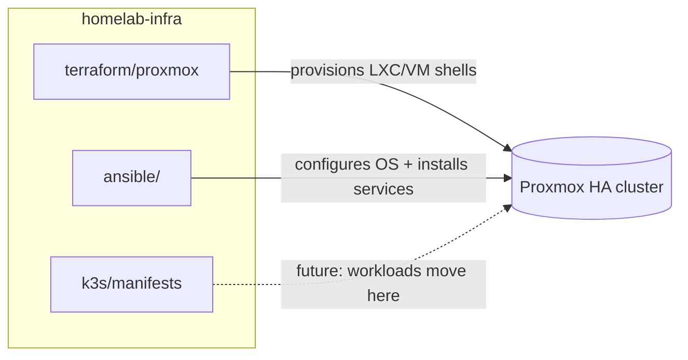

# homelab-infra

Infrastructure-as-code for my Proxmox homelab (`host1`, 192.168.1.10).

## Layout

- `terraform/proxmox/` — provisions new LXCs/VMs on Proxmox via the `bpg/proxmox` provider.
- `terraform/cloud/` — future home for Azure/AWS resources.
- `ansible/` — configuration management for hosts once Terraform has created them.
- `k3s/manifests/` — Kubernetes manifests, once services start moving into k3s.

## Philosophy

Terraform provisions (creates the LXC/VM shell), Ansible configures (installs and manages what runs
inside it). Existing hand-built services are **not** being retroactively imported into Terraform —
this repo only manages things created through it from now on. Old services get pulled in gradually,
one at a time, as they're rebuilt or migrated.

## Getting started

```bash
# Terraform
cd terraform/proxmox
cp terraform.tfvars.example terraform.tfvars   # fill in your real API token — this file is gitignored
terraform init
terraform plan

# Ansible
cd ../../ansible
ansible-inventory -i inventory/hosts.yml --list   # sanity check the inventory
ansible-playbook -i inventory/hosts.yml playbooks/site.yml --check   # dry run
```

## Secrets

Nothing that looks like a credential belongs in this repo. `terraform.tfvars`, `*.tfstate`, and any
Ansible Vault files are gitignored. Generate a Proxmox API token scoped to what Terraform needs
(Datacenter → Permissions → API Tokens) rather than using the root password.

## Architecture



Terraform creates the container or VM shell on the cluster; Ansible then configures what runs
inside it (packages, users, service config). k3s is the eventual home for services currently
running as standalone LXCs/Docker containers, migrated over one at a time rather than all at once.
See [ROADMAP.md](ROADMAP.md) for where this is headed.
